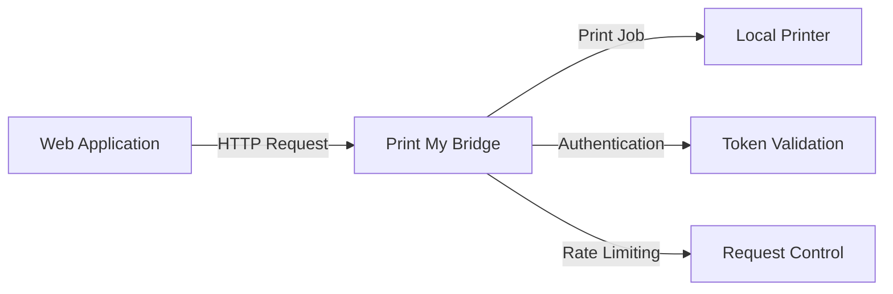

Print My Bridge is a desktop application that creates a secure HTTP bridge for remote printing. It allows you to send print jobs to local printers through a REST API with authentication and rate limiting.

## What is Print My Bridge?

Print My Bridge solves the challenge of printing from web applications to local printers by creating a secure bridge between your browser and local printing infrastructure. The application runs on your desktop and exposes a REST API that web applications can use to print documents.

<Note>
Print My Bridge uses token-based authentication and rate limiting to ensure secure access to your local printers.
</Note>

## Key features

Print My Bridge offers a comprehensive set of features for secure remote printing:

<CardGroup cols={2}>
  <Card title="Remote printing" icon="print">
    Send print jobs to local printers via HTTP API from any web application
  </Card>
  
  <Card title="Secure authentication" icon="lock">
    Token-based API authentication protects your printing endpoints
  </Card>
  
  <Card title="Rate limiting" icon="gauge">
    Configurable request rate limiting prevents abuse and overuse
  </Card>
  
  <Card title="Cross-platform" icon="desktop">
    Available for Windows 10+, macOS 10.13+, and Linux
  </Card>
  
  <Card title="Configurable" icon="gear">
    Flexible configuration options for security, file types, and behavior
  </Card>
  
  <Card title="System tray" icon="window-minimize">
    Runs in the background with system tray integration
  </Card>
</CardGroup>

## Architecture overview

Print My Bridge is built with modern, performant technologies:

- **Tauri**: Cross-platform desktop framework for the GUI
- **Rust**: High-performance backend with Tokio async runtime
- **Warp**: Fast HTTP server framework for the REST API
- **System integration**: Direct integration with operating system print subsystems

The application architecture consists of three main components:

<Steps>
  <Step title="Desktop application">
    The Tauri-based GUI runs on your desktop, providing configuration management and token generation
  </Step>
  
  <Step title="HTTP server">
    A Warp-based HTTP server runs in the background, exposing REST API endpoints for printing operations
  </Step>
  
  <Step title="Printer integration">
    Native printer integration communicates directly with your operating system's print subsystem
  </Step>
</Steps>

## How it works

When you start Print My Bridge, it launches an HTTP server on your local machine (default: `http://127.0.0.1:8765`). Web applications can then send print requests to this server using the REST API:

All API requests (except health checks) require a valid authentication token that you generate through the application interface.

## Use cases

Print My Bridge is ideal for several scenarios:

### Web-based applications

Enable printing functionality in web applications that need to print to users' local printers without browser print dialogs.

### Point of sale systems

Web-based POS systems can print receipts directly to receipt printers without manual intervention.

### Document management systems

Allow document management web applications to print files stored in the cloud to local printers.

### Remote printing solutions

Create remote printing capabilities for applications accessed from different locations.

<Tip>
Print My Bridge binds to localhost by default, ensuring that only applications on your local machine can access your printers. You can configure CORS settings to control which web applications can connect.
</Tip>

## Security considerations

Print My Bridge implements multiple security layers:

- **Token authentication**: All API endpoints require a valid bearer token
- **Rate limiting**: Configurable request limits prevent abuse (default: 60 requests/minute)
- **CORS protection**: Control which origins can access the API
- **File type validation**: Restrict allowed file types for printing
- **Local network only**: Server binds to localhost by default
- **File size limits**: Configurable maximum file size (default: 50MB)

<Warning>
Never expose Print My Bridge to the public internet. It is designed to run on localhost and should only be accessible from your local machine.
</Warning>

## Supported file types

By default, Print My Bridge supports printing these content types:

- PDF documents (`.pdf`)
- HTML content (`.html`)
- Plain text (`.txt`)
- Images (`.png`, `.jpg`, `.gif`)

You can configure allowed file types in the application settings.

## Next steps

<CardGroup cols={2}>
  <Card title="Installation" icon="download" href="/installation">
    Install Print My Bridge on your system
  </Card>
  
  <Card title="Quick start" icon="rocket" href="/quickstart">
    Get started with your first print job
  </Card>
</CardGroup>